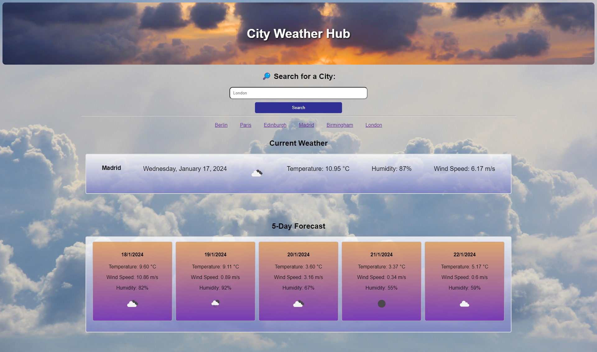

# City Weather Hub 🌦️

Direct Link to Application: [CLICK HERE](https://msalarzon.github.io/city-weather-hub/)

## Description

This project is a simple and user-friendly weather forecast application that allows users to check the current weather and a 5-day forecast for a specific city. The app features a clean and intuitive interface, making it easy for users to search for cities and view weather details.

- [Installation](#installation)
- [Features](#features)
- [Resources](#resources)
- [License](#license)

## Installation

To run this project locally, follow these steps:

1. Clone the repository to your local machine.
2. Open the `index.html` file in a web browser.
3. Use the search bar to type the name of the city and view the current weather along with a 5-day forecast.

## Features

Key Features:

- Search for a city and view the current weather conditions.
- Get a 5-day forecast to plan ahead.
- User-friendly design for easy navigation.
- Lightweight and easy to integrate into other projects.

## Resources

- [OpenWeatherMap API](https://openweathermap.org/): API used for retrieving weather data.
- [MDN Web Docs](https://developer.mozilla.org/): JavaScript documentation and examples.
- [Stack Overflow](https://stackoverflow.com/): Community for problem-solving and debugging.
- [W3Schools](https://www.w3schools.com/): Source for learning and practicing web development concepts.
- [GitHub](https://github.com/): For version control and project hosting.

## License

This project is licensed under the [MIT License](LICENSE). Feel free to use, modify, and distribute it at your own risk.
